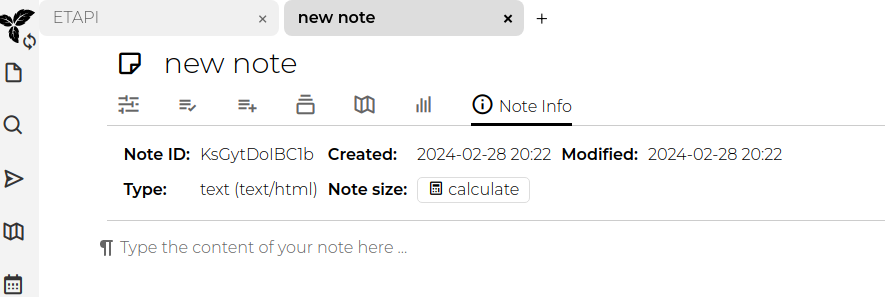

# omnivore2trilium
Export highlights from Omnivore directly into Trilium Notes

## Installation
Download the omnivore2trilium git repo. 

 ``` 
python3 -m venv venv
source venv/bin/activate
pip install omnivoreql
pip install trilium_py
 ``` 

## API Tokens
Authenticating to both Omnivore and Trilium Notes requires an API token for each service. 

Instructions to generate tokens are at the following links
- https://docs.omnivore.app/integrations/api.html#getting-an-api-token - Omnivore
- Trilium Notes:
  - Click on the "Main menu"
  - Click "Options"
  - Click "ETAPI"
  - Click "Create New ETAPI Token"

Put the token's in the "file" matching each token to the line that starts with the service. Each line of the file must start with either "omnivore:" or "trilium:" so that the software knows which token belong to a particular service.  Lines that do not start with the required prefix will be ignored by the software.

## Usage
Make sure that the Python virtual environment is activated:

```source venv/bin/activate```

Basic execution:

```python3 omnivore2trilium.py -k key```

This uses the keys (within the key file ) to retrieve highlights from 10 notes and store them in the root note.

```python3 omnivore2trilium.py -k ../keys.txt -d 30 -a all -l 100 -p BE5Id3adb33f```

This will retrieve Omnivore highlights made in the last 30 days and places within Trilium under the Note with Id "BE5Id3adb33f". 

### Available options

```
usage: omnivore2trilium.py [-h] [-k KEYS] [-a {inbox,archive,all}] [-p PARENTNOTEID] [-d DAYS] [-o] [-l LIMIT]

Omnivore2Trilium: Send your Omnivore Highlights to Trilium Notes

options:
  -h, --help            show this help message and exit
  -k KEYS, --keys KEYS  File containing tokens to authenticate to Omnivore and Trilium.
  -a {inbox,archive,all}, --archive {inbox,archive,all}
                        Extract highlights from the inbox, archive, or all. (default is all)
  -p PARENTNOTEID, --parentNoteId PARENTNOTEID
                        Note ID of the parent Trilium Note. (defaults to root)
  -d DAYS, --days DAYS  Number of days ago the the articles were highlighted.
  -o, --overwrite       Overwrite content of existing note. (Erases any changes in Trilium)
  -l LIMIT, --limit LIMIT
                        Limit number of articles returned by Omnivore (limit 100)
```

### Locating the NoteID
The noteId for any note can be found by clicking the "Note Info" icon towards the top of the note. After clicking the icon, you will see the field called "Note ID". 



This is the value needed for the parentNoteId. 

## Shoutouts
Special thanks to
- [OmnivoreQL](https://github.com/yazdipour/OmnivoreQL)
- [Trilium-py](https://github.com/Nriver/trilium-py)

These projects made Omnivore2trilium possibile.

Additionally thanks to [Omnivore](https://omnivore.app/) and [Trilium Notes](https://github.com/zadam/trilium) for making two great FOSS projects.